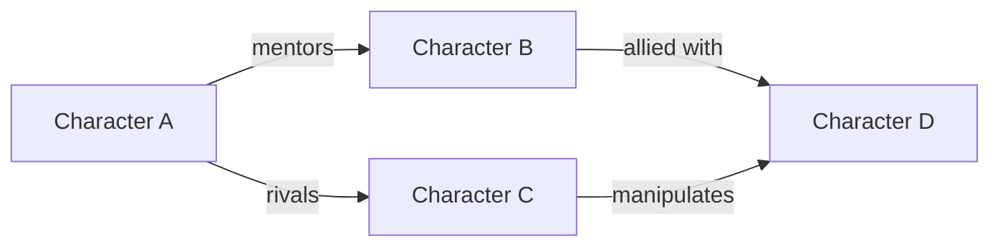

# Wiki Documentation

Create canonical, reader-facing reference pages for your story's characters, locations, events, and lore. These are polished encyclopedic entries — the "single source of truth" that readers, writers, and critics consult.

## Two Documentation Spaces

**`wiki/` (or project equivalent)** — Reader-facing. Polished, encyclopedic tone, spoiler-managed, link-disciplined. What this skill produces.

**`$MERIDIAN_FS_DIR/`** — Author/agent-facing. Annotated with decision reasoning, source tags, open questions, and implementation notes. Maintained by knowledge maintenance agents (session-miner, chronicler, graph-maintainer). Not this skill's territory.

The distinction matters because reader-facing docs and author-facing docs serve different purposes. A wiki page about a character presents their canonical state. The `$MERIDIAN_FS_DIR/characters/` entry for the same character includes why certain choices were made, what alternatives were considered, and what's planned but unrevealed.

## Core Principles

### Canonical Only

Wiki pages contain confirmed information — facts from written chapters, finalized worldbuilding, author-decided details. If something isn't decided yet, it belongs in brainstorming notes, not the wiki.

### Encyclopedic Tone

Write like a reference work:
- Third person, neutral voice
- Past tense for completed events, present for current state
- Factual, not narrative (describe what happened, not how it felt)
- No author commentary or speculation

### Citations

Every claim needs a source. See [`resources/citation-guide.md`](resources/citation-guide.md) for detailed formats:
- Chapter references for story facts
- Worldbuilding document references for lore created before writing
- Scene-specific citations when precision matters

### Link Discipline

Every entity mention gets a link on first appearance in a page. This means:
- Characters, locations, events, systems — linked on first mention
- Use wikilinks (`[[Entity Name]]`) or markdown links (`[Entity Name](entity-name.md)`) — match the project's convention
- Don't link the same entity repeatedly — first appearance in each section is enough
- Link to pages that exist or should exist (flag missing pages: `[[Entity Name]]` *(page needed)*)

Link discipline serves navigation — a reader should be able to follow connections between entities without searching.

### Relationship Diagrams

For pages involving complex relationships (character pages with many connections, faction pages, event pages with multiple parties), embed mermaid diagrams showing the relationship structure.

```markdown
## Relationships


```

Use diagrams when relationships are complex enough that a list alone would be hard to follow. Simple pages with one or two relationships don't need diagrams.

## Structure

Structure should fit the content. See [`resources/page-patterns.md`](resources/page-patterns.md) for examples ranging from minimal (3 lines) to complex (full article with sections, diagrams, and detailed citations). Don't force complex structure onto simple content.

**Include what matters, skip what doesn't.** A minor supporting character might be a name, role, and chapter reference. A protagonist might need sections on background, personality, abilities, relationships, and arc progression.

Trust your judgment on what each page needs.

## Spoiler Management

Wiki pages that contain information revealed later in the story need spoiler handling:

**YAML frontmatter:**
```yaml
spoilers: true
spoiler_level: major  # or minor
```

**Inline spoilers** (for details hidden behind interaction):
```markdown
<details>
<summary>Major Spoilers — Chapter 15+</summary>
Content revealed in later chapters...
</details>
```

## Contradiction Handling

When sources contradict:
- Note both versions explicitly
- Cite both sources
- Flag for author resolution: `[Contradiction: Chapter 2 says X, Chapter 8 says Y — clarification needed]`

Don't silently pick one version. The author decides canon.

## Creating Pages

1. Determine what needs documenting and what structure fits
2. Write what matters — skip irrelevant sections
3. Add citations (see [`resources/citation-guide.md`](resources/citation-guide.md))
4. Add links to related entities on first mention
5. Add relationship diagrams where complexity warrants them
6. Set spoiler frontmatter if applicable

## Resources

- [`resources/page-patterns.md`](resources/page-patterns.md) — examples from minimal to complex, covering characters, locations, lore, events, and organizations
- [`resources/citation-guide.md`](resources/citation-guide.md) — citation formats: inline, reference sections, contradiction handling, spoiler citations
